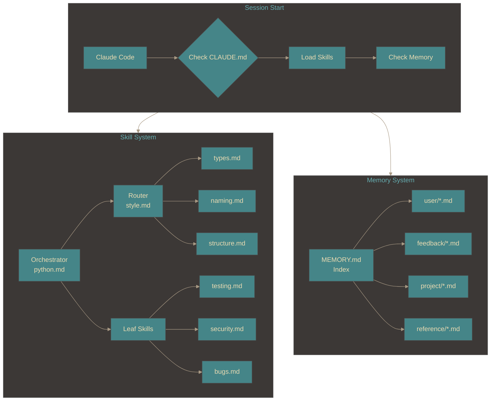
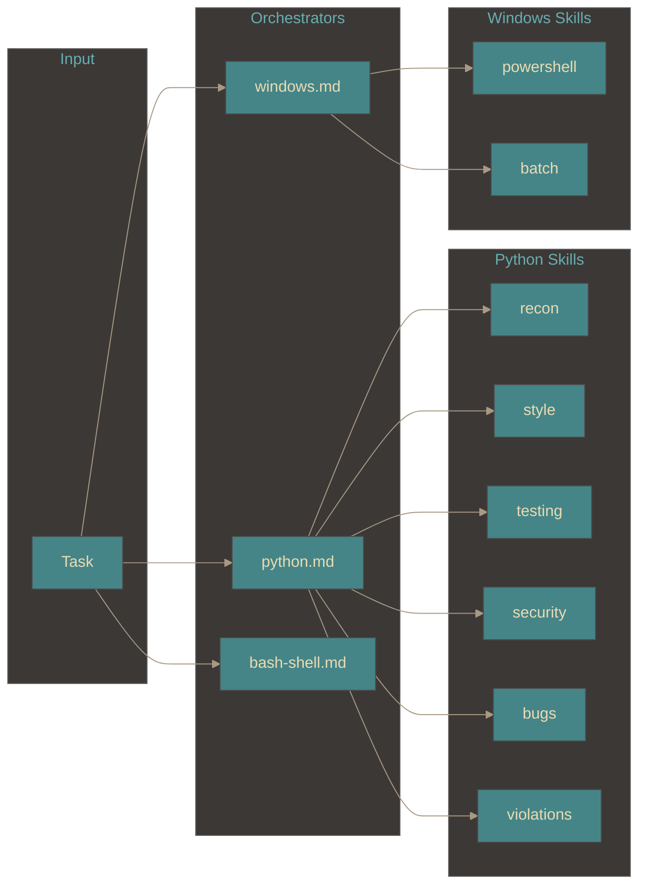
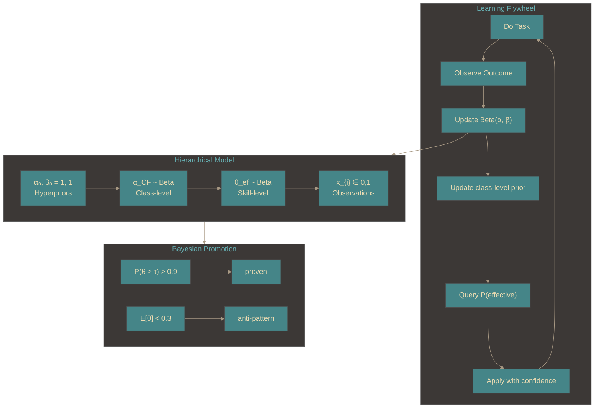
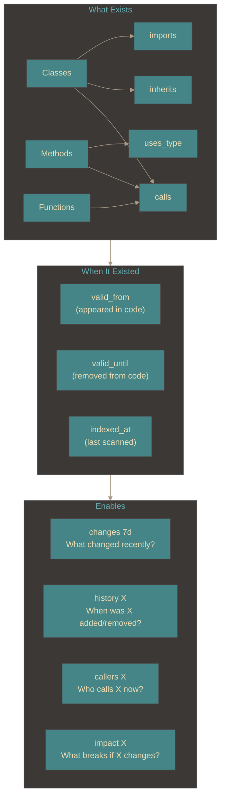

# Claude code configuration

Personal Claude Code skills, memory, and templates.

## Python project lifecycle

Complete flow from session start through development with learning:

```mermaid
%%{init: {"theme": "base", "themeVariables": {"primaryColor": "#458588", "primaryTextColor": "#ebdbb2", "lineColor": "#a89984", "clusterBkg": "#3c3836"}}}%%
flowchart TB
    subgraph Session["🚀 Session Start"]
        S1[Open Python Project] -->      S2{code_index exists?}
        S2                      -->|No|  S3["Build index<br/>build_index_temporal.py"]
        S2                      -->|Yes| S4{Fresh? under 7 days}
        S4                      -->|No|  S3
        S3                      -->      S5[Index Ready]
        S4                      -->|Yes| S5
        S5                      -->      S6{profile.json exists?}
        S6                      -->|No|  S7["Run recon.md"]
        S6                      -->|Yes| S8[Load Profile]
        S7                      -->      S8
    end

    subgraph Query["🔍 Pre-Work Queries"]
        Q1[Task Received] -->      Q2["Search code graph<br/>query_temporal.py search"]
        Q2                -->      Q3["Check flywheel<br/>flywheel.py recommend"]
        Q3                -->      Q4{Similar work done?}
        Q4                -->|Yes| Q5["Load proven skills<br/>+ past lessons"]
        Q4                -->|No|  Q6[Use default strategy]
        Q5                -->      Q7[Context Assembled]
        Q6                -->      Q7
    end

    subgraph Skills["📚 Skill Pipeline"]
        SK1[Load python.md] --> SK2["Route to leaf skills"]
        SK2                 --> SK3["style.md<br/>types/naming/structure"]
        SK2                 --> SK4["testing.md<br/>conftest/mocking"]
        SK2                 --> SK5["security.md<br/>bugs.md"]
        SK3                 --> SK6[Code Generated]
        SK4                 --> SK6
        SK5                 --> SK6
    end

    subgraph Validate["✅ Validation Loop (within-task)"]
        V1[violations.md] -->            V2{ruff clean?}
        V2                -->|No, retry| V1
        V2                -->|Yes|       V4[bugs.md]
        V4                -->            V5{Issues?}
        V5                -->|No, retry| V4
        V5                -->|Yes|       V7[test-gen.md]
        V7                -->            V8{Tests pass?}
        V8                -->|No|        V9[Max retries?]
        V9                -->|No|        V1
        V9                -->|Yes|       V10[Task Failed]
        V8                -->|Yes|       V11[Task Succeeded]
    end

    subgraph Learn["🧠 Flywheel Learning (across-tasks)"]
        L1[Final Outcome] -->      L2{Success?}
        L2                -->|Yes| L3["skill score +2"]
        L2                -->|No|  L4["skill score -2"]
        L3                -->      L5["Record episode<br/>with lessons learned"]
        L4                -->      L5
        L5                -->      L6["Over time:<br/>noise → correctable → proven"]
    end

    subgraph Update["📊 Update Knowledge (bi-temporal)"]
        U1{Code changed?} -->|Yes| U2["Scan changed files"]
        U2                -->      U3["Removed entities:<br/>set valid_until = now"]
        U2                -->      U4["New entities:<br/>set valid_from = commit_ts"]
        U2                -->      U5["Modified entities:<br/>close old + create new"]
        U3                -->      U6["Update indexed_at"]
        U4                -->      U6
        U5                -->      U6
        U6                -->      U7["ChromaDB: upsert embeddings"]
        U7                -->      U8[Index Current]
        U1                -->|No|  U8
    end

    subgraph Future["🔮 Next Session"]
        F1[New Task] --> F2["Query: what worked?"]
        F2           --> F3["Proven skills suggested<br/>Anti-patterns warned"]
        F3           --> F4[Better starting point]
    end

    Session  -->             Query
    Query    -->             Skills
    Skills   -->             Validate
    Validate -->             Learn
    Learn    -->             Update
    Update   -.->|Persisted| Future
```

## System interconnection

How skills, the knowledge graph, and the flywheel work together.

```mermaid
%%{init: {"theme": "base", "themeVariables": {"primaryColor": "#458588", "primaryTextColor": "#ebdbb2", "lineColor": "#a89984", "clusterBkg": "#3c3836"}}}%%
flowchart LR
    subgraph Input["Input"]
        T[Task]
    end

    subgraph KG["Knowledge Graph<br/>.claude/code_index/"]
        subgraph SQL["SQLite: code_graph.db"]
            KG1[Entities<br/>825 classes/methods/functions]
            KG2[Relations<br/>6529 calls/inherits/imports]
            KG3[Bi-temporal<br/>valid_from/until]
        end
        subgraph VEC["ChromaDB: chroma_db/"]
            KG4[Embeddings<br/>semantic search]
        end
    end

    subgraph Skills["Skills<br/>.config/claude/skills/"]
        SK1[python.md<br/>orchestrator]
        SK2[Leaf skills<br/>testing/security/bugs]
        SK3[profile.json<br/>project context]
    end

    subgraph FW["Flywheel<br/>flywheel.py"]
        FW1[Skills table<br/>proven/anti-pattern]
        FW2[Episodes<br/>task history]
        FW3[Evidence<br/>success/failure counts]
    end

    subgraph Output["Output"]
        O[Informed Action]
    end

    T   --> KG4
    T   --> SK1
    T   --> FW1

    KG4 -->|"find related code"| KG1
    KG1 -->|"what exists?"|      SK2
    KG2 -->|"what calls what?"|  SK2
    SK3 -->|"project patterns"|  SK2

    FW1 -->|"what worked?"|  SK2
    FW2 -->|"past lessons"| SK2

    SK2 --> O

    O   -->|outcome| FW3
    FW3 -->|update|  FW1
```

## Architecture Overview



## Skill Routing

Tasks flow through orchestrators to specialized leaf skills:



## Python Skill Pipeline

```mermaid
%%{init: {"theme": "base", "themeVariables": {"primaryColor": "#458588", "primaryTextColor": "#ebdbb2", "lineColor": "#a89984", "clusterBkg": "#3c3836"}}}%%
flowchart TB
    subgraph Recon["1. Recon Phase"]
        R1[Session Start] -->      R2{profile.json<br/>exists & fresh?}
        R2                -->|No|  R3[Run recon.md]
        R3                -->      R4[Generate profile.json]
        R2                -->|Yes| R5[Load profile]
        R4                -->      R5
    end

    subgraph PreGen["2. Pre-Generation"]
        P1[Check profile.json] --> P2[Find existing patterns]
        P2                     --> P3[Extend, don't duplicate]
    end

    subgraph PostGen["3. Post-Generation"]
        G1[violations.md] -->      G2{Clean?}
        G2                -->|No|  G1
        G2                -->|Yes| G3[bugs.md]
        G3                -->      G4{Clean?}
        G4                -->|No|  G3
        G4                -->|Yes| G5[test-gen.md]
    end

    Recon  --> PreGen
    PreGen --> PostGen
```

## Probabilistic flywheel

The flywheel uses **Bayesian learning** with Beta distributions:



### Generative Model

$$\alpha_{CF} \sim \text{Beta}(a_{0}, b_{0}) \quad \text{(class-level prior)}$$

$$\theta_{ef} \mid \alpha_{CF} \sim \text{Beta}(\alpha_{CF} \cdot \kappa, (1-\alpha_{CF}) \cdot \kappa) \quad \text{(skill prior from class)}$$

$$x_{i} \mid \theta_{ef} \sim \text{Bernoulli}(\theta_{ef}) \quad \text{(observations)}$$

### Key Equations

**Expected success rate:**

$$\mathbb{E}[\theta] = \frac{\alpha}{\alpha + \beta}$$

**Uncertainty (standard deviation):**

$$\sigma = \sqrt{\frac{\alpha \beta}{(\alpha + \beta)^2 (\alpha + \beta + 1)}}$$

**Probability skill is effective:**

$$P(\theta > \tau) = 1 - I_{\tau}(\alpha, \beta)$$

where $I_{\tau}$ is the regularized incomplete beta function and $\tau = 0.7$.

**Posterior update after outcome $x \in \{0, 1\}$:**

$$\alpha' = \alpha + x, \quad \beta' = \beta + (1 - x)$$

### Bayesian Promotion

$$ \text{class} = \begin{cases}
\texttt{proven} & \text{if } P(\theta > 0.7 \mid \text{data}) > 0.9 \\
\texttt{anti-pattern} & \text{if } \mathbb{E}[\theta] < 0.3 \text{ and } n \geq 5 \\
\texttt{correctable} & \text{if } n \geq 2 \\
\texttt{noise} & \text{otherwise}
\end{cases}$$

### Meta-Learning Transfer

For new skill $(e', f')$ with zero direct evidence:

$$\mathbb{E}[\theta_{e'f'}] = \mathbb{E}[\alpha_{CF}] = \frac{a_{0} + s_{CF}}{a_{0} + b_{0} + n_{CF}}$$

where $s_{CF}$ = class-level successes, $n_{CF}$ = class-level observations.

```
New error: "numpy_abi_conflict" (never seen)
    ↓
Classify: dependency class (C)
    ↓
Inherit: θ ~ Beta(α_CF · κ, (1-α_CF) · κ)
    ↓
Recommend: "constrain fixes work 82% ± 8% for dependency errors"
```

### Hyperparameters


| Symbol         | Default | Meaning                 |
|----------------|---------|-------------------------|
| $a_{0}, b_{0}$ | 1, 1    | Prior (uniform)         |
| $\kappa$       | 10      | Concentration           |
| $\tau$         | 0.7     | Effectiveness threshold |

### CLI

```bash
python3 flywheel.py status                    # Bayesian metrics
python3 flywheel.py skills --bayesian         # Show α, β, μ, σ
python3 flywheel.py recommend missing_module  # With confidence intervals
python3 flywheel.py meta                      # Class-level knowledge
python3 flywheel.py classify version_conflict # Test classification
```

## Code Knowledge Graph

Bi-temporal graph tracking code entities and relationships:



**Bi-temporal = two time axes:**
| Axis                 | Field                       | Tracks                      |
|----------------------|-----------------------------|-----------------------------|
| **Valid time**       | `valid_from`, `valid_until` | When entity existed in code |
| **Transaction time** | `indexed_at`                | When we learned about it    |

This separation enables: "Show me what the code looked like on date X" vs "Show me what we knew on date Y".


## Skill Design Principles

| Principle               | Description                          |
|-------------------------|--------------------------------------|
| **Gini Purity**         | Each leaf skill handles ONE concept  |
| **Orchestrator → Leaf** | Routers don't do work, they route    |
| **Tables > Prose**      | Dense, scannable reference           |
| **1 Example > Many**    | Show, don't tell                     |
| **Linkable**            | Use `[[skill-name]]` for composition |

## Memory Types

| Type          | When to save                      | Example                            |
|---------------|-----------------------------------|------------------------------------|
| **user**      | User role, preferences, knowledge | "User is senior Python dev"        |
| **feedback**  | Corrections and confirmations     | "Don't mock the database"          |
| **project**   | Ongoing work, goals, deadlines    | "Merge freeze starts Thursday"     |
| **reference** | External system pointers          | "Bugs tracked in Linear project X" |

## Sources & Inspirations

### Third-Party Skill Repos

| Repo                                                                                                      | What was used                                               |
|-----------------------------------------------------------------------------------------------------------|-------------------------------------------------------------|
| [trailofbits/skills](https://github.com/trailofbits/skills)                                               | modern-python, property-testing, insecure-defaults patterns |
| [LambdaTest/agent-skills](https://github.com/LambdaTest/agent-skills)                                     | pytest patterns, BDD patterns                               |
| [Agent-Skills-for-Context-Engineering](https://github.com/davidpp/Agent-Skills-for-Context-Engineering)   | memory-systems, multi-agent patterns, flywheel concept      |
| [context-engineering-kit](https://github.com/anthropics/context-engineering-kit)                          | Plugin architecture patterns                                |
| [Roarpeng/GraphFlow](https://github.com/Roarpeng/GraphFlow)                                               | Code knowledge graph, learning flywheel                     |

### Knowledge Graph Tools

| Tool                                            | Architecture               | Use Case              |
|-------------------------------------------------|----------------------------|-----------------------|
| [Cognee](https://github.com/topoteretes/cognee) | Multi-layer semantic graph | Dense knowledge graphs |
| [Graphiti](https://github.com/getzep/graphiti)  | Temporal knowledge graph   | Bi-temporal queries   |
| [Mem0](https://github.com/mem0ai/mem0)          | Vector + graph memory      | Multi-tenant memory   |

### Key Concepts Borrowed

| Concept            | Source              | Implementation                    |
|--------------------|---------------------|-----------------------------------|
| **Gini purity**    | ToB skills          | Each skill = one concept          |
| **Corpus pattern** | ToB insecure-defaults | VULNERABLE/SECURE examples        |
| **Recon phase**    | ToB multi-agent     | profile.json before work          |
| **Flywheel**       | GraphFlow           | Skills accumulate from outcomes   |
| **Bi-temporal**    | Graphiti            | valid_from/valid_until tracking   |
| **Episode memory** | Context Engineering | Task → outcome → lessons          |

## Quick Reference

### Load a Skill

```
[[python]]                    # Load orchestrator
[[python/testing]]            # Load specific leaf
[[python/security]]           # Load another leaf
```

### Query Code Index

```bash
# Semantic search
python3 query_temporal.py search "build docker"

# Relational
python3 query_temporal.py callers my_function
python3 query_temporal.py impact MyService

# Temporal
python3 query_temporal.py changes 7d
```

### Query Flywheel

```bash
python3 flywheel.py status
python3 flywheel.py skills --class proven
python3 flywheel.py recommend missing_module
```

## Design Philosophy

> **Skills are dense, self-contained, and linkable.**
> Complexity emerges from composition, not from the parts.

> **Memory is typed and persistent.**
> What the agent learns survives across sessions.

> **The flywheel gets better with use.**
> Task 1000 benefits from tasks 1-999.
$$
